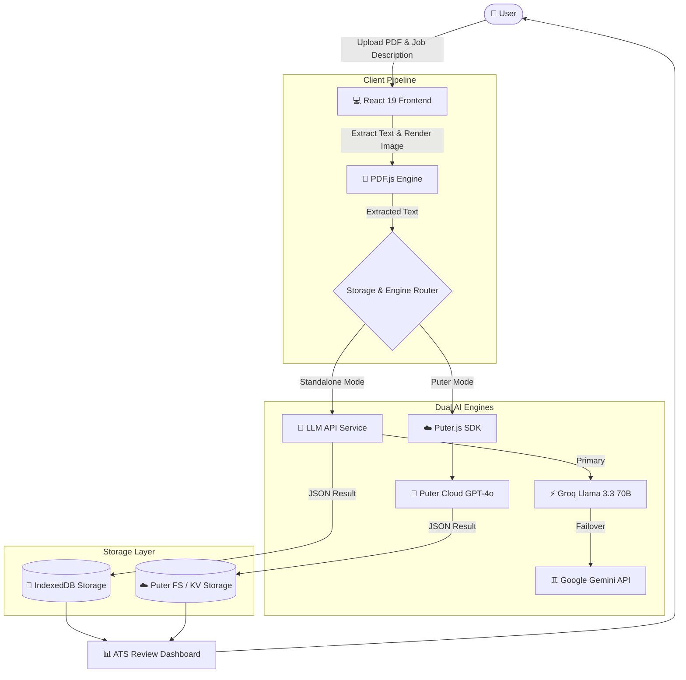

# 📄 AI Resume Analyser — Resumind ⚡
### *AI-Powered Resume Scoring & ATS Optimization Platform*

[](https://ai-resume-analyser-frgy.onrender.com)
[](https://puter.com/app/ai-resume-analyser-24)
[](https://react.dev/)
[](https://www.typescriptlang.org/)
[](https://vitejs.dev/)
[](https://tailwindcss.com/)

---

## 📌 About The Project

**Resumind AI Resume Analyser** is an enterprise-grade full-stack web application designed to evaluate resumes against target job descriptions using state-of-the-art LLM models. It extracts text from PDF resumes, performs deep structural and semantic ATS (Applicant Tracking System) compatibility analysis, and delivers detailed scoring breakdowns alongside actionable improvement tips.

The platform operates on a **Dual-Engine Architecture**:
1. **Standalone LLM Engine**: Directly queries fast LLM API providers (**Groq Llama 3.3 70B** & **Google Gemini API**) with automatic failover fallback and local **IndexedDB** persistence.
2. **Puter Cloud Engine**: Seamlessly integrates with **Puter.js** serverless cloud infrastructure for zero-setup AI analysis and cloud file storage.

---

## 🖼️ Application Interface


---

## 🛠️ Tech Stack & Tools

### **Frontend & Framework**
* **React 19** & **React Router v7** — Full-stack React framework with SSR and SPA capabilities.
* **TypeScript** — End-to-end static typing, strict type safety, and interface models.
* **Tailwind CSS v4** — Utility-first styling with custom glassmorphism effects and modern UI tokens.
* **Zustand** — Lightweight global state management store.

### **Artificial Intelligence & LLMs**
* **Groq API** (`llama-3.3-70b-versatile`) — Ultra-fast inference engine for instant evaluation.
* **Google Gemini API** (`gemini-1.5-flash`) — Generative multimodal AI for deep resume scoring.
* **Puter AI** (`gpt-4o`) — Serverless cloud-based AI processing via Puter.js SDK.
* **Structured JSON Prompting** — Custom prompt schemas ensuring deterministic JSON output parsing.

### **Document Processing & Storage**
* **PDF.js (`pdfjs-dist`)** — Client-side PDF text extraction and high-resolution HTML5 Canvas rendering.
* **IndexedDB (`idb`)** — Asynchronous client-side browser database for offline storage.
* **Puter FS & KV** — Serverless cloud filesystem and Key-Value store.

### **Deployment & DevOps**
* **Render.com** — Cloud production Web Service (`render.yaml`).
* **Puter Cloud** — Containerless web app hosting.
* **Vite** — Next-gen frontend tooling and module bundler.

---

## ✨ Key Features

* **⚡ Dual-Engine Analysis**: Switch seamlessly between standalone LLM API calls and Puter cloud environment.
* **🎯 Comprehensive ATS Score**: Evaluates Overall Match (0–100%), ATS Formatting, Tone & Style, Content Relevance, Structure, and Alignment with Skills.
* **📑 High-Res Visual PDF Preview**: Converts uploaded PDF resumes to interactive canvas previews displayed side-by-side with AI review cards.
* **💡 Actionable Improvement Tips**: Provides color-coded positive highlights (`Good`) and constructive suggestions (`Improve`).
* **🔄 Automatic Provider Failover**: If the primary API encounters rate limits, the system instantly falls back to secondary LLM endpoints without breaking user workflow.
* **💾 Local Offline Persistence**: Stores analysis history in browser **IndexedDB**, allowing users to review past ATS scores without re-uploading files.
* **🔒 Privacy-First Configuration**: API keys are securely managed via backend environment variables (`.env`).

---

## 🏗️ System Architecture



---

## 🚀 Getting Started Guide

### **Prerequisites**
* **Node.js** `>= 18.0.0`
* **npm** `>= 9.0.0`

### **1. Clone the Repository**
```bash
git clone https://github.com/ReshmiRayKarmakar08/ai-resume-analyser.git
cd ai-resume-analyser
```

### **2. Install Dependencies**
```bash
npm install
```

### **3. Configure Environment Variables**
Create a `.env` file in the root directory:
```env
# API Keys for AI Resume Analyser
VITE_GROQ_API_KEY=your_groq_api_key_here
VITE_GEMINI_API_KEY=your_gemini_api_key_here
VITE_DEFAULT_PROVIDER=groq
```

> 💡 *Need free API keys? You can get a free key instantly from [Groq Console](https://console.groq.com/keys) or [Google AI Studio](https://aistudio.google.com/).*

### **4. Run Development Server**
```bash
npm run dev
```
Open **`http://localhost:5173`** in your browser.

### **5. Build for Production**
```bash
npm run build
```

---

## ☁️ Deployment Guide (Render)

This repository includes a pre-configured `render.yaml` specification for automated deployment on **Render.com**.

1. Go to [Render Dashboard](https://dashboard.render.com/) and click **New +** -> **Web Service**.
2. Connect repository `ReshmiRayKarmakar08/ai-resume-analyser`.
3. Set the configuration options:
   * **Build Command**: `npm install && npm run build`
   * **Start Command**: `npm run start`
4. Add your Environment Variables (`VITE_GROQ_API_KEY` and `VITE_GEMINI_API_KEY`).
5. Click **Create Web Service**.

---

## 🤝 Author & License

Developed with ❤️ by **Reshmi Ray Karmakar**

* 🌐 **GitHub**: [@ReshmiRayKarmakar08](https://github.com/ReshmiRayKarmakar08)
* 🚀 **Live URL (Render)**: [ai-resume-analyser-frgy.onrender.com](https://ai-resume-analyser-frgy.onrender.com)
* ⚡ **Live URL (Puter)**: [puter.com/app/ai-resume-analyser-24](https://puter.com/app/ai-resume-analyser-24)

*This project is licensed under the MIT License.*
